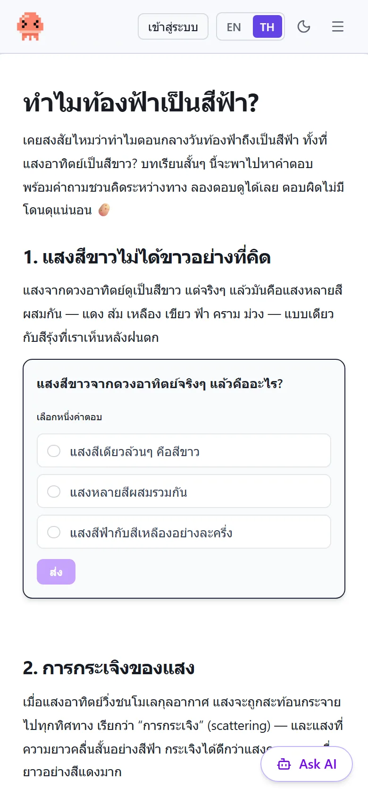
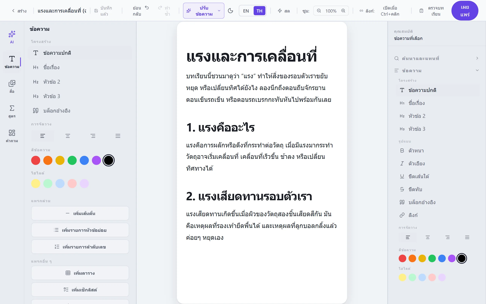
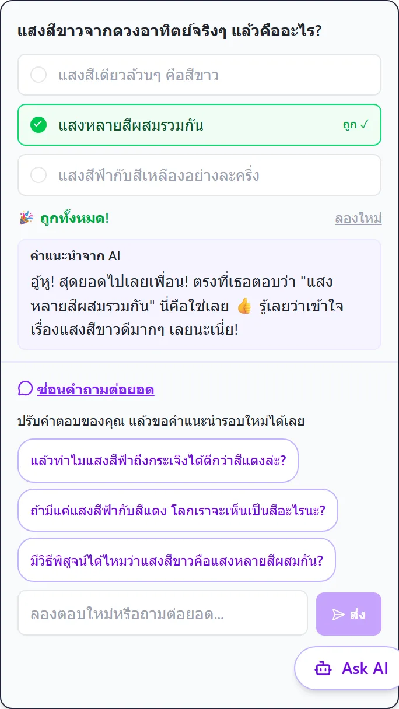
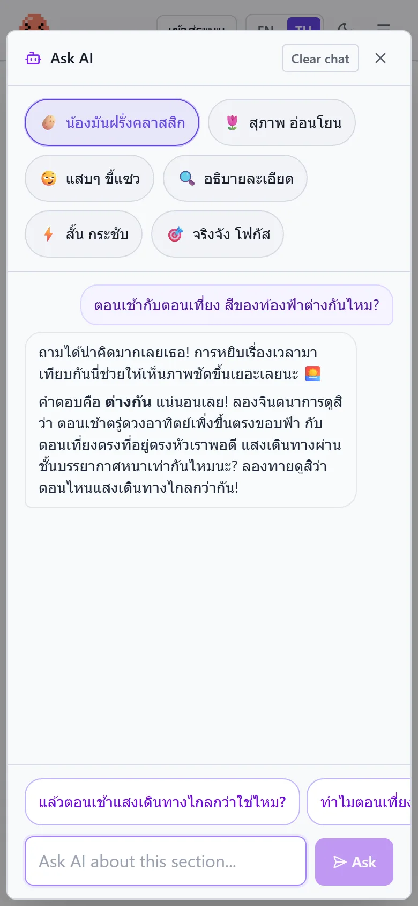
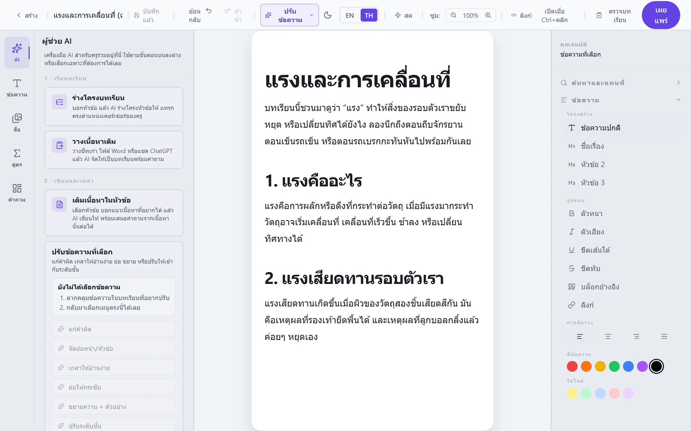
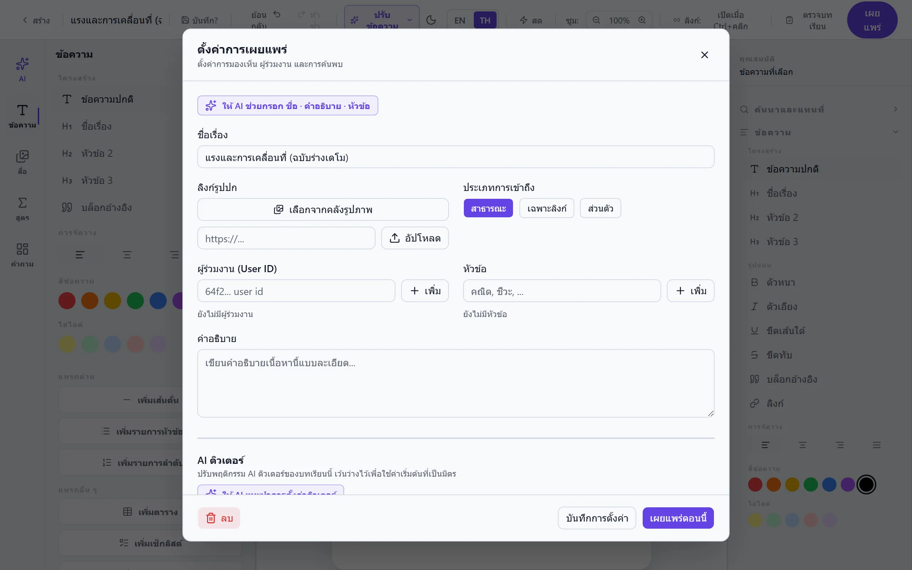

<div align="center">

# Hot Potato

**An AI-powered learning platform where teachers author interactive lessons and students learn with a personal AI tutor.**

[](https://react.dev)
[](https://www.typescriptlang.org)
[](https://vitejs.dev)
[](https://tailwindcss.com)

[](https://expressjs.com)
[](https://www.mongodb.com)
[](https://ai.google.dev)

[**Live Demo**](https://hot-potato-client.vercel.app) · [**Live API**](https://hot-potato-server.onrender.com) · [**Server Repository**](https://github.com/Jakkarin-Promsee/hot-potato-server)

</div>

---

## Overview

Hot Potato is a full-stack learning platform designed for students who are far from good schools and reliable internet. Teachers — including non-technical ones — author rich lessons with embedded critical-thinking questions. Students read the lessons, answer the questions, and can freely ask an AI tutor (Google Gemini) anything about the content. The AI responds with warm, coaching-style feedback in Thai by default, rather than plain grading.

The project is split across two repositories. **This repository contains the web client and serves as the project's main documentation** — everything you need to understand and run the whole platform starts here.

| Repository | Role | Stack | Hosted on |
| --- | --- | --- | --- |
| **hot-potato-client** (this repo) | Web app — teacher editor + student viewer + AI chat surfaces | React 19, TypeScript, Vite 7, Tailwind CSS v4 | [Vercel](https://hot-potato-client.vercel.app) |
| [**hot-potato-server**](https://github.com/Jakkarin-Promsee/hot-potato-server) | REST API — auth, lesson storage, student progress, the entire AI layer | Express 5, TypeScript, MongoDB (Mongoose 9), Google Gemini | [Render](https://hot-potato-server.onrender.com) |

Two product principles shape the entire codebase:

1. **AI access is never rationed for real students** — there are no per-student quotas. Rate limiting exists only to stop bots, with generous, environment-tunable thresholds.
2. **Anonymous users keep full access** — reading lessons and using the AI tutor never requires an account. Logging in only adds persistence (answer history, chat history, tutor memory).

## Screenshots

| Lesson viewer | Lesson editor |
| --- | --- |
|  |  |

| AI tutor feedback | Ask-AI free chat |
| --- | --- |
|  |  |

| Teacher AI copilot hub | Publish settings |
| --- | --- |
|  |  |

More walkthrough scenes live on the site itself: [student walkthrough](https://hot-potato-client.vercel.app/guide/learning) · [teacher walkthrough](https://hot-potato-client.vercel.app/guide/creating). All screenshots are generated automatically with Playwright (`scripts/capture-guide.mjs`) against seeded demo data — never hand-captured.

## Features

### For students

- **Interactive lesson viewer** — rich text, images, tables, embedded YouTube, math formulas, and drawings, rendered read-only from the same document format the editor produces.
- **Five embedded question types** — multiple choice, open-ended writing (AI-evaluated), fill-in-the-blank (choice and typed), and an embedded free-form AI tutor block.
- **Streaming AI tutor** — answers stream token-by-token over SSE, render as safe markdown, and end with up to three tappable follow-up suggestion chips. Every question card supports a follow-up conversation thread.
- **Six tutor personalities** — students pick the coaching style they like; the choice persists and is attached to every AI call.
- **Tutor memory** — for logged-in students the tutor builds a lightweight sketch of interests, strengths, and growth areas over time, viewable and erasable from the profile page.
- **No login wall** — anonymous visitors can read every public lesson and use the AI tutor in full; conversation context is kept client-side and sent per request.
- **Answer persistence and history** — answers autosave per block; recently opened lessons appear in the history page.

### For teachers

- **Block-based lesson editor** — built on TipTap 3 with custom node types: a resizable-image node, an embedded Fabric.js drawing canvas, a visual math-formula builder that serializes to LaTeX (rendered with KaTeX), and the five question blocks.
- **AI copilot inside the editor** — a dedicated AI hub with eleven assistive actions: lesson outlining, section drafting, structure import, proofreading (six presets), question generation, guide-answer drafting, distractor suggestions, a lesson critic, and publish-metadata autofill. Every AI output goes through a **preview → accept** flow; nothing touches the document without explicit approval.
- **Per-lesson tutor controls** — teachers configure the AI tutor's persona note, answer-directness, scope, and custom guidelines per lesson at publish time.
- **Access control** — lessons can be public, link-only, or private, with collaborator support.
- **Image library** — Cloudinary-backed upload and folder organization.

### Platform & AI engine (server side)

- **One unified tutor endpoint** — `POST /api/chat/tutor` serves four conversation modes (free chat, question feedback, writing evaluation, follow-up) with SSE streaming and a plain-JSON fallback.
- **Server-owned lesson context** — the server loads and serializes the lesson for every AI call (cached), so the client never ships lesson text over the wire.
- **Model routing and resilience** — lightweight tasks go to a fast Gemini model, coaching tasks to a stronger one; transient network failures are retried automatically.
- **Authentication** — email/password (bcrypt) and Google Sign-In (verified Google Identity Services ID tokens with safe account auto-linking), JWT sessions, and role-based guards (`admin` / `creator` / `learner`).
- **Safe concurrent editing** — lesson updates use optimistic concurrency; conflicting edits return 409 instead of silently overwriting.
- **Bilingual UI** — Thai and English interface language, with Thai as the default AI output language.
- **Theming and performance** — light/dark theme, app-wide font-size control, self-hosted fonts, route-level code splitting with heavy vendor libraries (TipTap, Fabric, KaTeX) in separate lazy chunks. The entry chunk stays around 138 kB gzipped.

## Architecture

The two halves communicate over a REST API. The client attaches a JWT `Bearer` token to every request through a single configured Axios instance; AI replies stream back over Server-Sent Events. In production the client is a static SPA on **Vercel**, the API runs on **Render**, data lives in **MongoDB Atlas**, images in **Cloudinary**, and AI inference on **Google Gemini**.

### Client (this repository)

```
src/
├── App.tsx              # router + route guards (the page map)
├── main.tsx             # React root
├── index.css            # Tailwind v4 entry + theme tokens
├── pages/               # one component per route (all lazy-loaded except Landing)
├── layouts/             # AppLayout — shared chrome via <Outlet/>
├── components/
│   ├── ui/              # shadcn/ui primitives
│   ├── editor/          # the lesson editor: TipTap + Fabric + question blocks
│   │   ├── extensions/  # custom nodes (questions, canvas, image) + tutorApi.ts
│   │   ├── ai/          # teacher AI copilot surfaces
│   │   └── FormulaBlock/ # visual math builder → LaTeX
│   └── *.tsx            # TopNav, route guards, ThemeToggle, ...
├── stores/              # Zustand global state (auth, content, answers, ...)
├── hooks/               # Fabric canvas hooks
├── lib/                 # axios instance, creator API bridge, cloudinary, utils
└── types/               # shared TypeScript types
```

Key design decisions:

- **Single API bridge per AI surface.** All student-facing AI calls go through `src/components/editor/extensions/tutorApi.ts` (`callTutor` / `callTutorStream`), and all teacher-copilot calls through `src/lib/creatorApi.ts`. Streaming falls back to plain JSON transparently if SSE fails before the first token.
- **The TipTap document is the single source of truth.** All editor block data — canvas drawings, question definitions, formulas — lives in node attributes and serializes with the document.
- **Route guards, not scattered checks.** `ProtectedRoute` (hard redirect), `RequireLogin` (soft inline prompt), and `PublicRoute` (bounce authenticated users) wrap routes declaratively in `App.tsx`.
- **Auth token lives in one store.** The Axios instance reads the token from the Zustand auth store outside React and reacts to the server's structured 401 contract by logging out and redirecting only on protected paths.

### Server ([hot-potato-server](https://github.com/Jakkarin-Promsee/hot-potato-server))

An MVC-structured Express 5 + TypeScript service: **route → auth middleware → controller → Mongoose model**, with cross-cutting logic (lesson serialization, AI persona building, retries, observability) in a services layer. The API surface in one glance:

| Group | Base path | What it covers |
| --- | --- | --- |
| Auth | `/api/auth` | Register, login, Google Sign-In, token recheck, change password |
| Content | `/api/content` | Create / load / update / delete / search lessons, access control |
| Answers | `/api/content-answer` | Per-student answer maps, single and bulk save |
| AI chat | `/api/chat` | The unified tutor endpoint + student tutor-memory |
| Teacher copilot | `/api/creator` | One endpoint, eleven authoring actions |
| Users | `/api/users` | Profile read/update, admin user list |
| History | `/api/history` | Recently visited lessons |
| Media | `/api/categories`, `/api/images` | Cloudinary image library + folders |
| Status | `/api/status` | Public aggregated health check + admin diagnostics |

The full per-endpoint reference, data model, AI integration internals, and security notes live in the [server README](https://github.com/Jakkarin-Promsee/hot-potato-server#readme).

## Tech stack

| Layer | Technology |
| --- | --- |
| Frontend core | React 19, TypeScript, Vite 7 |
| Styling | Tailwind CSS v4 (CSS-first config), shadcn/ui (Radix primitives), lucide-react, sonner |
| Client state | Zustand (global stores), TanStack Query (server state) |
| Routing / HTTP | React Router 7, Axios |
| Rich text & canvas | TipTap 3 (+ tiptap-markdown), Fabric.js 7, KaTeX, react-markdown + remark-gfm |
| Backend | Node.js, Express 5, TypeScript |
| Database | MongoDB with Mongoose 9 |
| AI | Google Gemini via `@google/genai` (fast + tutor model routing) |
| Auth | JWT, bcrypt, Google Identity Services (`@react-oauth/google` + `google-auth-library`) |
| Media | Cloudinary (unsigned upload) |
| Testing | Vitest + happy-dom (client), Vitest + Supertest + `mongodb-memory-server` (server) |
| Deployment | Vercel (client), Render (server), MongoDB Atlas |

## Getting started

Running the whole platform locally takes two terminals: one for the API, one for the web app.

### Prerequisites

- **Node.js 20.19+** (or 22.12+) and npm
- A **MongoDB** database — a free [MongoDB Atlas](https://www.mongodb.com/atlas) cluster works, or a local instance
- A **Google Gemini API key** — free from [Google AI Studio](https://aistudio.google.com/)
- A **Cloudinary** account (cloud name + unsigned upload preset) for image uploads
- Optional: a **Google OAuth Web client ID** ([Google Cloud Console](https://console.cloud.google.com/)) to enable Sign in with Google

### 1. Set up the server

```bash
git clone https://github.com/Jakkarin-Promsee/hot-potato-server.git
cd hot-potato-server
npm install
```

Create `hot-potato-server/.env`:

```env
PORT=5000
MONGO_URI=mongodb+srv://<user>:<pass>@<cluster>/<db>
JWT_SECRET=replace-with-a-long-random-string
JWT_EXPIRES_IN=7d
GEMINI_API_KEY=your-gemini-api-key
CLOUDINARY_CLOUD_NAME=your-cloud-name
CLOUDINARY_UPLOAD_PRESET=your-unsigned-preset

# Optional
GOOGLE_CLIENT_ID=your-google-oauth-client-id   # enables POST /auth/google
CORS_ORIGINS=http://localhost:5173             # unset = open (dev only)
AI_OUTPUT_LANGUAGE=thai                        # or "english"
```

Optional tuning knobs (AI model selection, rate limits, memory cadence) are documented in the [server README](https://github.com/Jakkarin-Promsee/hot-potato-server#readme).

Start the API:

```bash
npm run dev      # → http://localhost:5000
```

Verify it is up: `GET http://localhost:5000/` returns a health string, and `GET http://localhost:5000/api/status/all` returns an aggregated systems check.

### 2. Set up the client

```bash
git clone https://github.com/Jakkarin-Promsee/hot-potato-client.git
cd hot-potato-client
npm install
```

Create `hot-potato-client/.env`. Only `VITE_`-prefixed variables are exposed to the browser:

```env
VITE_API_URL=http://localhost:5000
VITE_CLOUDINARY_CLOUD_NAME=your-cloud-name
VITE_CLOUDINARY_UPLOAD_PRESET=your-unsigned-preset
VITE_GOOGLE_CLIENT_ID=your-google-oauth-client-id   # optional
```

| Variable | Required | Description |
| --- | --- | --- |
| `VITE_API_URL` | yes | Base URL of the server API (no trailing slash) |
| `VITE_CLOUDINARY_CLOUD_NAME` | yes | Cloudinary account name — use the same account as the server |
| `VITE_CLOUDINARY_UPLOAD_PRESET` | yes | Cloudinary unsigned upload preset |
| `VITE_GOOGLE_CLIENT_ID` | no | Google OAuth Web client ID; when unset, the Google Sign-In button is hidden. Use the same client ID as the server's `GOOGLE_CLIENT_ID`, with `http://localhost:5173` registered as an authorized origin |

Start the web app:

```bash
npm run dev      # → http://localhost:5173
```

### 3. Try it

Open `http://localhost:5173`, register an account (or stay anonymous), create a lesson from the dashboard, and open it in the viewer — the AI tutor works immediately once the server's `GEMINI_API_KEY` is set.

## Available scripts

| Script | Description |
| --- | --- |
| `npm run dev` | Start the Vite dev server |
| `npm run build` | Production build → `dist/` |
| `npm run preview` | Serve the production build locally |
| `npm run lint` | Run ESLint |
| `npm test` | Run the Vitest suite (happy-dom, offline) |

Server-side scripts (test suite, live AI smoke tests, admin promotion) are listed in the [server README](https://github.com/Jakkarin-Promsee/hot-potato-server#readme).

## Testing

Both halves ship offline test suites — no network, no real database, no API key needed:

- **Client:** Vitest + happy-dom. Tests live next to the code they cover (`src/**/__tests__/`) — stores, axios helpers, route guards, editor bridges, AI copilot surfaces, and page-level tests.
- **Server:** Vitest + Supertest with an in-memory MongoDB and a mocked Gemini client, covering every endpoint group plus prompt builders and retry logic.

```bash
npm test         # in either repository
```

## Deployment

| Half | Platform | Configuration |
| --- | --- | --- |
| Client | **Vercel** | Build `npm run build`, output `dist/`. `vercel.json` rewrites all paths to `index.html` for SPA routing. Set the `VITE_*` variables in the dashboard with `VITE_API_URL` pointing at the production API. |
| Server | **Render** | Build `npm install && npm run build`, start `npm start`. Set every server `.env` variable in the dashboard, including `CORS_ORIGINS` with the client's production origin. |

> **Cold starts:** on Render's free tier the API sleeps when idle, so the first request after a pause takes several seconds on top of normal AI latency. The client accounts for this with loading states throughout.

## Related repositories

| Repository | Description |
| --- | --- |
| [hot-potato-server](https://github.com/Jakkarin-Promsee/hot-potato-server) | Express 5 + TypeScript REST API: auth, lesson storage, student progress, and the Gemini AI integration — full API reference in its README |

## Author

**Jakkarin Promsee** — Computer Engineering, KMUTT

- GitHub: [@Jakkarin-Promsee](https://github.com/Jakkarin-Promsee)
- Email: jakkarin.promsee@gmail.com
